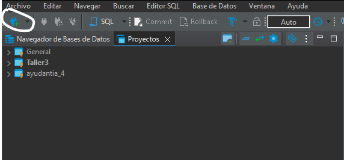
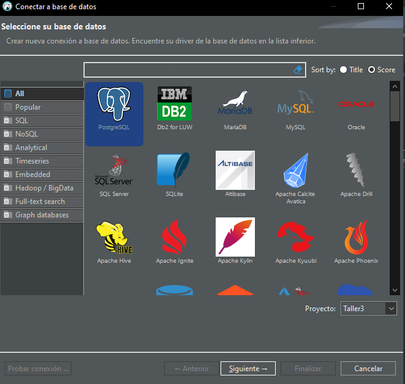
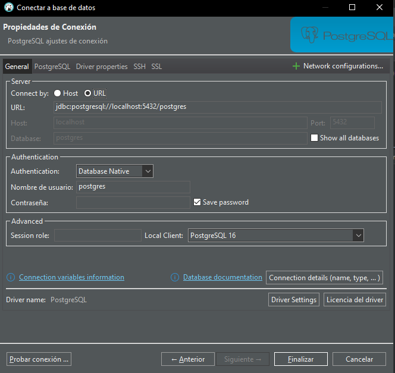

# JDBC Template Project

Este proyecto es una plantilla para conectar y operar con una base de datos PostgreSQL usando JDBC.

## Requisitos

- **Java 8 o superior**: Asegúrate de tener el JDK instalado. Puedes descargarlo desde [Oracle JDK](https://www.oracle.com/java/technologies/javase-downloads.html) o [OpenJDK](https://openjdk.java.net/install/).
- **Maven**: Herramienta de gestión de proyectos y dependencias. Puedes descargarlo desde [Apache Maven](https://maven.apache.org/download.cgi).
  - **Alternativa**: Si usas Visual Studio Code, puedes instalar la extensión [Extension Pack for Java](https://marketplace.visualstudio.com/items?itemName=vscjava.vscode-java-pack), que incluye herramientas de soporte para Java y permite manejar dependencias de Maven sin una instalación adicional.
- **PostgreSQL**: Sistema de gestión de bases de datos. Puedes descargarlo desde [PostgreSQL](https://www.postgresql.org/download/).

## Configuración

### 1. Instalar Java

- Descarga e instala el JDK desde [Oracle JDK](https://www.oracle.com/java/technologies/javase-downloads.html) o [OpenJDK](https://openjdk.java.net/install/).
- Asegúrate de configurar la variable de entorno `JAVA_HOME` apuntando al directorio de instalación del JDK.
- Agrega el directorio `bin` del JDK a la variable de entorno `Path`.

### 2. Instalar Maven (opcional si usas Visual Studio Code con la extensión "Extension Pack for Java")

- Descarga la versión binaria ZIP o TAR.GZ de Maven desde [Apache Maven](https://maven.apache.org/download.cgi).
- Extrae el archivo descargado en una ubicación de tu elección, por ejemplo, `C:\Program Files\Apache\Maven`.
- Configura la variable de entorno `MAVEN_HOME` apuntando al directorio de instalación de Maven.
- Agrega `%MAVEN_HOME%\bin` a la variable de entorno `Path`.

### 3. Instalar PostgreSQL

- Descarga e instala PostgreSQL desde [PostgreSQL](https://www.postgresql.org/download/).
- Durante la instalación, configura una contraseña para el usuario `postgres`.
- Asegúrate de que PostgreSQL esté en ejecución.

Les recomiendo utilizar DBeaver para la creacion de la base de datos,
deben presionar en nueva conexion


Luego presionan postgres y siguiente



Finalmente seleccionan URL para obtener la url de conexion
y definen el nombre de usuario y contraseña


Presionan finalizar y ya deberian tener su base de datos lista para usar

### 4. Clonar el Repositorio

- Clona el repositorio:
  ```sh
  git clone <https://github.com/DavidDidus/Example-Taller-3.git>
  cd jdbc-template
